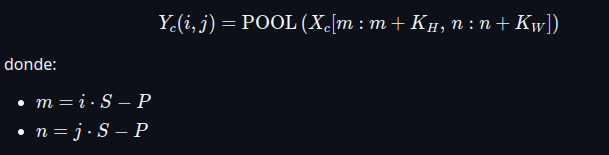
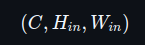

# Convolutional Neural Network

By Braulio Nayap Maldonado Casilla

## Introducción

La convolución es una operación matemática fundamental en el procesamiento de imágenes y en las redes neuronales convolucionales (CNN, por sus siglas en inglés). Esta operación permite extraer patrones locales de una entrada multidimensional, como bordes, texturas o estructuras complejas, mediante el uso de filtros o kernels que se deslizan sobre la imagen de entrada.

## Convolución

Es una operación fundamental en redes neuronales convolucionales (CNN) que permite extraer patrones locales de una entrada multidimensional, como imágenes. Consiste en aplicar pequeños filtros (o kernels) que recorren la entrada realizando productos punto en regiones locales, generando mapas de características que capturan bordes, texturas y otras estructuras. Esta operación reduce la cantidad de parámetros y mejora la eficiencia en el aprendizaje de representaciones jerárquicas.

### Fórmula de la convolución discreta 2D

La salida en la posición (i, j) del canal de salida c_out, aplicando una convolución sobre una entrada multicanal, se calcula como:


| Símbolo              | Significado                                                  |
| -------------------- | ------------------------------------------------------------ |
| Y_c_out (i, j)       | Valor en la posición (i,j) del canal de salida c_out         |
| X_c_in (i,j)         | Valor en la posición (i,j) del canal de entrada c_in         |
| K_c_out, c_in (m, n) | Valor del kernel que conecta c_in => c_out en posición (m,n) |
| b_c_out              | Sesgo (bias) correspondiente al canal de salida c_out        |
| S                    | Stride (paso de desplazamiento)                              |
| P                    | Padding (relleno con ceros alrededor de la entrada)          |
| C_in                 | Número de canales de entrada                                 |
| C_out                | Número de filtros / canales de salida                        |
| K_H, K_W             | Altura y ancho del kernel                                    |

### Fórmulas para calcular el tamaño de salida de la convolución

Dada una entrada tridimensional de tamaño:


y una convolución definida por:

- Kernel de tamaño K_H x K_W
- Stride S
- Padding P
- Número de filtros C_out

El tamaño de la salida será:


| Símbolo | Significado                                       |
| ------- | ------------------------------------------------- |
| C_in    | Número de canales de la entrada (ej. 3 si es RGB) |
| H_in    | Altura (filas) de la entrada                      |
| W_in    | Ancho (columnas) de la entrada                    |
| K_H     | Altura del kernel (filtro)                        |
| K_W     | Ancho del kernel (filtro)                         |
| P       | Padding (número de ceros añadidos en los bordes)  |
| S       | Stride (paso con el que se desplaza el filtro)    |
| C_out   | Número de filtros (canales de salida)             |
| H_out   | Altura del mapa de características de salida      |
| W_out   | Ancho del mapa de características de salida       |
| ⌊⌋      | Parte entera inferior (redondeo hacia abajo)      |

### Funciones de activación en la salida de la convolución

Después de aplicar la convolución, se utiliza una **función de activación** para introducir no linealidad en el modelo. Esto permite que la red aprenda relaciones más complejas que una combinación lineal de entradas. Las funciones de activación más comunes son:


- **ReLU (Rectified Linear Unit)**: convierte los valores negativos en cero, permitiendo una propagación eficiente del gradiente. Se usa por defecto en la mayoría de las capas convolucionales.
- **Sigmoide**: transforma los valores en el rango (0, 1), útil en tareas de clasificación binaria, pero puede causar saturación en redes profundas.
- **Tanh**: mapea los valores entre (-1, 1), útil cuando se desea que la salida esté centrada en cero, aunque también puede saturarse.

Cada función se elige según la tarea: **ReLU** es la más común en capas ocultas, mientras que **sigmoide** o **tanh** pueden usarse en la capa de salida o en arquitecturas específicas.

---

## Pooling

Es una operación que se aplica a los mapas de características (feature maps) generados por la convolución para reducir sus dimensiones espaciales (alto y ancho). Esta reducción ayuda a disminuir la cantidad de parámetros, reducir el costo computacional y controlar el overfitting. Además, permite que la red sea más robusta a pequeñas translaciones y deformaciones en la entrada.

A diferencia de la convolución, el pooling no tiene pesos entrenables. En su lugar, aplica una función de agregación (como máximo, promedio o mínimo) sobre regiones locales del mapa de características.

### Fórmula del pooling 2D

La salida en la posición `(i, j)` del canal `c`, aplicando una operación de pooling sobre una entrada, se calcula como:



La función `POOL` puede ser `max`, `avg` o `min`, y se aplica sobre una región de tamaño K_H x K_W.

| Símbolo   | Significado                                          |
| --------- | ---------------------------------------------------- |
| Y_c(i, j) | Valor en la posición (i,j) del canal de salida `c`   |
| X_c       | Canal de entrada                                     |
| K_H, K_W  | Altura y ancho de la ventana de pooling              |
| S         | Stride (paso con el que se desplaza la ventana)      |
| P         | Padding (ceros añadidos en los bordes de la entrada) |
| POOL      | Operación de agregación (máximo, promedio o mínimo)  |

### Fórmula para calcular el tamaño de salida del pooling

Dada una entrada tridimensional de tamaño:



Y una operación de pooling definida por:

- Tamaño de ventana K_H x K_W
- Stride `S`
- Padding `P`

El tamaño de la salida será:


| Símbolo  | Significado                                   |
| -------- | --------------------------------------------- |
| C        | Número de canales (no cambia con pooling)     |
| H_in     | Altura de la entrada                          |
| W_in     | Ancho de la entrada                           |
| K_H, K_W | Altura y ancho de la ventana de pooling       |
| P        | Padding (relleno con ceros)                   |
| S        | Stride (paso de desplazamiento de la ventana) |
| H_out    | Altura del mapa de características de salida  |
| W_out    | Ancho del mapa de características de salida   |
| ⌊ ⌋      | Parte entera inferior (redondeo hacia abajo)  |

### Tipos de pooling

| Tipo de pooling     | Descripción                                                                                                    |
| ------------------- | -------------------------------------------------------------------------------------------------------------- |
| **Max pooling**     | Toma el valor máximo de cada región. Resalta las características más fuertes y es el más común en CNNs.        |
| **Average pooling** | Calcula el promedio de los valores en cada región. Suaviza la representación y se usa para resúmenes globales. |
| **Min pooling**     | Toma el valor mínimo de cada región. Es menos común, útil en contextos donde interesa conservar mínimos.       |

---

## Flatten

La operación **Flatten** (aplanamiento) transforma una entrada multidimensional (por ejemplo, un tensor 3D de una imagen con canales, alto y ancho) en un **vector unidimensional**. Es una operación común en redes convolucionales justo antes de conectar con capas densas (**fully connected**), que esperan vectores como entrada en lugar de tensores.

Flatten **no modifica los valores** del tensor, solo cambia su forma (shape), reorganizando los datos en un único vector.

Este permite conectar las salidas de capas convolucionales (2D o 3D) con una o más capas totalmente conectadas (densas). Así, permite que las características extraídas espacialmente por la red sean procesadas por una red neuronal clásica para tareas como clasificación.

### Fórmula para el tamaño de salida

Si la entrada tiene dimensiones (C,H,W) ,entonces, después del flatten, el tamaño de salida será:


Es decir, se convierte en un vector de dimensión 1D:


| Símbolo | Significado                                       |
| ------- | ------------------------------------------------- |
| C       | Número de canales (depth)                         |
| H       | Altura del mapa de características                |
| W       | Ancho del mapa de características                 |
| ×       | Multiplicación para obtener el tamaño total plano |

---

## Implementación en C++

### Activaciones

Este módulo implementa funciones de activación utilizadas en redes neuronales, junto con sus derivadas. Las funciones incluidas son **sigmoide**, **ReLU** y **tanh**, y están disponibles como funciones `inline` para mayor eficiencia en tiempo de ejecución. También se define el enumerador `ActivationType` para seleccionar fácilmente una función durante la construcción de capas.

```cpp
enum ActivationType
{
    SIGMOID,
    RELU,
    TANH
};
```

---

- Función `sigmoid`: Calcula la función logística, usada comúnmente en tareas de clasificación binaria.

```cpp
inline double sigmoid(double x)
{
    return 1.0 / (1.0 + exp(-x));
}
```

- Función `relu`: Aplica la unidad lineal rectificada, que convierte los valores negativos en cero.

```cpp
inline double relu(double x)
{
    return x > 0 ? x : 0;
}
```

- Función `tanh_fn`: Aplica la tangente hiperbólica, una función centrada en cero que produce valores en el intervalo (-1, 1).

```cpp
inline double tanh_fn(double x)
{
    return std::tanh(x);
}
```

---

### Clase `Conv2D`

La clase `Conv2D` representa una capa convolucional tridimensional utilizada en redes neuronales convolucionales. Implementa tanto la propagación hacia adelante (`forward`) como hacia atrás (`backward`) para aprendizaje supervisado. Esta clase admite entrada 3D con múltiples canales (por ejemplo, RGB) y soporta parámetros como padding y stride. Los filtros se inicializan aleatoriamente y se aplican sobre la entrada para generar mapas de activación.

```cpp
class Conv2D
{
private:
    int in_channels, out_channels;
    int kernel_h, kernel_w;
    int stride, padding;
    std::vector<std::vector<std::vector<std::vector<double>>>> filters;
    std::vector<double> biases;
    std::vector<std::vector<std::vector<std::vector<double>>>> d_filters;
    std::vector<double> d_biases;
    std::vector<std::vector<std::vector<double>>> last_input;
    std::vector<std::vector<std::vector<double>>> pad_input(
        const std::vector<std::vector<std::vector<double>>> &input);
    void initialize_filters();

public:
    Conv2D(int in_channels, int out_channels, int kernel_h, int kernel_w,
           int stride = 1, int padding = 0, ActivationType activation);
    std::vector<std::vector<std::vector<double>>> forward(
        const std::vector<std::vector<std::vector<double>>> &input);
    std::vector<std::vector<std::vector<double>>> backward(
        const std::vector<std::vector<std::vector<double>>> &grad_output);
};
```

#### Constructor `Conv2D`

Inicializa la capa convolucional con los parámetros:

- `in_channels`: número de canales de entrada.
- `out_channels`: número de filtros.
- `kernel_h`, `kernel_w`: altura y anchura del kernel.
- `stride`: paso con el que se aplica el filtro (por defecto 1).
- `padding`: número de ceros añadidos a los bordes (por defecto 0).
- `activation`: función de activación (por defecto ReLU).

Este constructor llama internamente a `initialize_filters()` para inicializar aleatoriamente los pesos y los sesgos de cada filtro.

```cpp
Conv2D::Conv2D(int in_channels, int out_channels, int kernel_h, int kernel_w,
               int stride, int padding, ActivationType activation_)
    : in_channels(in_channels), out_channels(out_channels),
      kernel_h(kernel_h), kernel_w(kernel_w),
      stride(stride), padding(padding), activation(activation_)
{
    initialize_filters();
}
```

#### Método `initialize_filters()`

Inicializa los pesos de los filtros utilizando la **estrategia de Xavier (Glorot) uniforme**, que genera valores aleatorios en el rango `[-limit,limit]`, donde:


Esto ayuda a mantener la varianza de las activaciones estable durante el entrenamiento. Se utiliza `std::mt19937` como generador y `std::uniform_real_distribution` para la distribución. Los sesgos se inicializan en cero.

```cpp
void Conv2D::initialize_filters()
{
    std::random_device rd;
    std::mt19937 gen(rd());

    int fan_in = in_channels * kernel_h * kernel_w;
    int fan_out = out_channels * kernel_h * kernel_w;
    double limit = std::sqrt(6.0 / (fan_in + fan_out));
    std::uniform_real_distribution<double> dis(-limit, limit);

    filters.resize(out_channels, std::vector<std::vector<std::vector<double>>>(
                                     in_channels, std::vector<std::vector<double>>(
                                                      kernel_h, std::vector<double>(kernel_w))));
    biases.resize(out_channels, 0.0);

    for (int oc = 0; oc < out_channels; ++oc)
        for (int ic = 0; ic < in_channels; ++ic)
            for (int i = 0; i < kernel_h; ++i)
                for (int j = 0; j < kernel_w; ++j)
                    filters[oc][ic][i][j] = dis(gen);
}
```

#### Método `pad_input(...)`

Aplica padding cero alrededor de la imagen de entrada. Si el padding es 0, simplemente devuelve la imagen original. Se utiliza tanto en el `forward` como en el `backward`.

```cpp
std::vector<std::vector<std::vector<double>>> Conv2D::pad_input(
    const std::vector<std::vector<std::vector<double>>> &input)
{
    int h = input[0].size();
    int w = input[0][0].size();
    int padded_h = h + 2 * padding;
    int padded_w = w + 2 * padding;

    std::vector<std::vector<std::vector<double>>> padded_input(in_channels,
                                                               std::vector<std::vector<double>>(padded_h, std::vector<double>(padded_w, 0.0)));
    for (int c = 0; c < in_channels; ++c)
        for (int i = 0; i < h; ++i)
            for (int j = 0; j < w; ++j)
                padded_input[c][i + padding][j + padding] = input[c][i][j];
    return padded_input;
}
```

#### Método `forward(...)`

- Recibe una entrada tridimensional con forma `[C_in][H_in][W_in]`, donde:

  - `C_in`: número de canales de entrada.
  - `H_in`: altura de la imagen.
  - `W_in`: ancho de la imagen.

- Se guarda la entrada original (sin padding) en `last_input` para su uso posterior en la función `backward`.

- Si `padding > 0`, se aplica **padding con ceros** mediante la función `pad_input`, lo que incrementa las dimensiones espaciales de la entrada.

- Se calcula el tamaño de salida `H_out` y `W_out` usando las fórmulas estándar de convolución (considerando stride y padding).

- Se inicializa un tensor de salida con forma `[C_out][H_out][W_out]`, donde `C_out` es el número de filtros.

- Para cada filtro (`out_channel`), se realiza:

  - Una operación de convolución sobre cada región de la entrada desplazándose con el `stride`.
  - En cada región:

    - Se toma una **ventana** de tamaño igual al kernel.
    - Se realiza el **producto punto** entre los valores de la ventana y los pesos del filtro.
    - Se suma el **bias** correspondiente.
    - El resultado se pasa a la funcion de activación y se guarda en la posición correspondiente del tensor de salida.

- Se repite el proceso para todos los filtros, obteniendo una salida final con `C_out` mapas de activación.

```cpp
std::vector<std::vector<std::vector<double>>> Conv2D::forward(
    const std::vector<std::vector<std::vector<double>>> &input)
{
    last_input = input;
    auto padded = (padding > 0) ? pad_input(input) : input;
    int h = padded[0].size();
    int w = padded[0][0].size();
    int out_h = (h - kernel_h) / stride + 1;
    int out_w = (w - kernel_w) / stride + 1;
    std::vector<std::vector<std::vector<double>>> output(out_channels,
                                                         std::vector<std::vector<double>>(out_h, std::vector<double>(out_w, 0.0)));
    for (int oc = 0; oc < out_channels; ++oc)
        for (int i = 0; i < out_h; ++i)
            for (int j = 0; j < out_w; ++j)
            {
                double sum = biases[oc];
                for (int ic = 0; ic < in_channels; ++ic)
                {
                    for (int ki = 0; ki < kernel_h; ++ki)

                        for (int kj = 0; kj < kernel_w; ++kj)
                        {
                            int xi = i * stride + ki;
                            int xj = j * stride + kj;
                            sum += padded[ic][xi][xj] * filters[oc][ic][ki][kj];
                        }
                }
                if (activation == RELU)
                    sum = relu(sum);
                else if (activation == SIGMOID)
                    sum = sigmoid(sum);
                else if (activation == TANH)
                    sum = tanh_fn(sum);
                output[oc][i][j] = sum;
            }
    return output;
}
```

#### Método `backward(...)`

- Recibe como entrada `grad_output`, que es el gradiente del error con respecto a la salida de la convolución. Tiene forma `[C_out][H_out][W_out]`.

- Si se usó `padding` durante el `forward`, se vuelve a aplicar `pad_input` sobre la entrada guardada (`last_input`) para reconstruir la entrada tal como se usó originalmente.

- Se inicializan:

  - `d_filters`: gradientes de los pesos de cada filtro, con la misma forma que `filters`.
  - `d_biases`: gradientes de los sesgos, uno por filtro.
  - `grad_input`: gradientes respecto a la entrada, con la misma forma que la entrada padded.

- Para cada posición `(i, j)` del gradiente de salida y cada filtro `oc`:

  - Se acumula el gradiente de salida en el sesgo correspondiente:
    `d_biases[oc] += grad_output[oc][i][j]`.

  - Para cada canal de entrada `ic`, y cada posición del kernel `(ki, kj)`:

    - Se calcula la posición correspondiente en la entrada padded:
      `xi = i * stride + ki`,
      `xj = j * stride + kj`.

    - Se actualiza el gradiente del filtro:
      `d_filters[oc][ic][ki][kj] += input[ic][xi][xj] * grad_output[oc][i][j]`.

    - Se actualiza el gradiente respecto a la entrada:
      `grad_input[ic][xi][xj] += filters[oc][ic][ki][kj] * grad_output[oc][i][j]`.

- Si se aplicó padding, se **recorta `grad_input`** eliminando las zonas externas, para devolver solo la parte correspondiente a la entrada original.

- Devuelve `grad_input`, que representa el gradiente del error respecto a la entrada de esta capa. Esto permite propagar el error hacia capas anteriores durante el entrenamiento.

```cpp
std::vector<std::vector<std::vector<double>>> Conv2D::backward(
    const std::vector<std::vector<std::vector<double>>> &grad_output)
{
    auto input = (padding > 0) ? pad_input(last_input) : last_input;

    int in_h = input[0].size();
    int in_w = input[0][0].size();
    int out_h = grad_output[0].size();
    int out_w = grad_output[0][0].size();

    d_filters.assign(out_channels,
                     std::vector<std::vector<std::vector<double>>>(in_channels,
                                                                   std::vector<std::vector<double>>(kernel_h,
                                                                                                    std::vector<double>(kernel_w, 0.0))));
    d_biases.assign(out_channels, 0.0);
    std::vector<std::vector<std::vector<double>>> grad_input(in_channels,
                                                             std::vector<std::vector<double>>(in_h, std::vector<double>(in_w, 0.0)));
    for (int oc = 0; oc < out_channels; ++oc)
        for (int i = 0; i < out_h; ++i)
            for (int j = 0; j < out_w; ++j)
            {
                double grad = grad_output[oc][i][j];
                d_biases[oc] += grad;
                for (int ic = 0; ic < in_channels; ++ic)
                    for (int ki = 0; ki < kernel_h; ++ki)
                        for (int kj = 0; kj < kernel_w; ++kj)
                        {
                            int xi = i * stride + ki;
                            int xj = j * stride + kj;
                            d_filters[oc][ic][ki][kj] += input[ic][xi][xj] * grad;
                            grad_input[ic][xi][xj] += filters[oc][ic][ki][kj] * grad;
                        }
            }
    if (padding > 0)
    {
        std::vector<std::vector<std::vector<double>>> unpadded(in_channels,
                                                               std::vector<std::vector<double>>(in_h - 2 * padding,
                                                                                                std::vector<double>(in_w - 2 * padding)));
        for (int c = 0; c < in_channels; ++c)
            for (int i = 0; i < in_h - 2 * padding; ++i)
                for (int j = 0; j < in_w - 2 * padding; ++j)
                    unpadded[c][i][j] = grad_input[c][i + padding][j + padding];
        return unpadded;
    }
    return grad_input;
}
```

---

### Clase `Pooling`

La clase `Pooling` representa una capa de reducción espacial utilizada en redes neuronales convolucionales. Implementa el método `forward()` que aplica una operación de **submuestreo** (pooling) sobre regiones locales de una entrada tridimensional `[C][H][W]`. Soporta los tipos de pooling más comunes: **max**, **min** y **average**, con parámetros configurables como tamaño de ventana, `stride` y `padding`.

```cpp
enum PoolingType
{
    MAX,
    MIN,
    AVERAGE
};

class Pooling
{
private:
    int kernel_h, kernel_w;
    int stride;
    int padding;
    PoolingType type;

    double pool_region(const std::vector<std::vector<double>> &region) const;

public:
    Pooling(int kernel_h, int kernel_w, int stride, int padding, PoolingType type);

    std::vector<std::vector<std::vector<double>>> forward(
        const std::vector<std::vector<std::vector<double>>> &input);
};
```

#### Constructor `Pooling`

Inicializa la capa de pooling con los parámetros:

- `kernel_h`, `kernel_w`: altura y anchura de la ventana de pooling.
- `stride`: paso de desplazamiento de la ventana.
- `padding`: número de ceros añadidos alrededor de la entrada.
- `type`: tipo de operación de pooling (`MAX`, `MIN`, `AVERAGE`).

```cpp
Pooling::Pooling(int kernel_h, int kernel_w, int stride, int padding, PoolingType type)
    : kernel_h(kernel_h), kernel_w(kernel_w), stride(stride), padding(padding), type(type) {}
```

#### Método `pool_region()`

Dado un bloque 2D (una región de la entrada), aplica la operación de pooling correspondiente:

- **MAX**: devuelve el valor máximo.
- **MIN**: devuelve el valor mínimo.
- **AVERAGE**: devuelve el promedio.

```cpp
double Pooling::pool_region(const std::vector<std::vector<double>> &region) const
{
    std::vector<double> flat;
    for (const auto &row : region)
        flat.insert(flat.end(), row.begin(), row.end());

    switch (type)
    {
    case PoolingType::MAX:
        return *std::max_element(flat.begin(), flat.end());
    case PoolingType::MIN:
        return *std::min_element(flat.begin(), flat.end());
    case PoolingType::AVERAGE:
        return std::accumulate(flat.begin(), flat.end(), 0.0) / flat.size();
    default:
        throw std::runtime_error("Unknown pooling type.");
    }
}
```

#### Método `forward()`

Aplica el pooling sobre la entrada 3D de forma canal por canal, dividiendo la entrada en bloques locales según el tamaño de la ventana (`kernel_h`, `kernel_w`) y desplazándose según el `stride` (como en la convolución). Si se sale de los bordes, se aplica `padding` con ceros.

El tamaño de salida se calcula como:


```cpp
std::vector<std::vector<std::vector<double>>> Pooling::forward(
    const std::vector<std::vector<std::vector<double>>> &input)
{
    int channels = input.size();
    int height = input[0].size();
    int width = input[0][0].size();
    int out_h = (height - kernel_h) / stride + 1;
    int out_w = (width - kernel_w) / stride + 1;
    std::vector<std::vector<std::vector<double>>> output(
        channels,
        std::vector<std::vector<double>>(out_h, std::vector<double>(out_w, 0.0)));
    for (int c = 0; c < channels; ++c)
        for (int i = 0; i < out_h; ++i)
            for (int j = 0; j < out_w; ++j)
            {
                std::vector<std::vector<double>> region(kernel_h, std::vector<double>(kernel_w, 0.0));
                for (int ki = 0; ki < kernel_h; ++ki)
                {
                    for (int kj = 0; kj < kernel_w; ++kj)
                    {
                        int row = i * stride + ki - padding;
                        int col = j * stride + kj - padding;

                        if (row >= 0 && row < height && col >= 0 && col < width)
                            region[ki][kj] = input[c][row][col];
                        else
                            region[ki][kj] = 0.0;
                    }
                }
                output[c][i][j] = pool_region(region);
            }
    return output;
}
```

---

### Clase `Flatten`

La clase `Flatten` representa una capa que convierte una entrada tridimensional (`[C][H][W]`) en un vector unidimensional. Además, `Flatten` permite invertir la operación mediante un método de `reshape()` que restaura la forma original.

```cpp
class Flatten
{
private:
    int channels, height, width;

public:
    std::vector<double> forward(const std::vector<std::vector<std::vector<double>>> &input);
    std::vector<std::vector<std::vector<double>>> reshape(const std::vector<double> &input_flat);
};
```

#### Método `forward()`

Convierte un tensor 3D `[C][H][W]` a un vector 1D de tamaño `C × H × W`. Guarda internamente la forma original para permitir una reconstrucción posterior.

```cpp
std::vector<double> Flatten::forward(const std::vector<std::vector<std::vector<double>>> &input)
{
    channels = input.size();
    height = input[0].size();
    width = input[0][0].size();

    std::vector<double> flat;
    flat.reserve(channels * height * width);

    for (int c = 0; c < channels; ++c)
        for (int i = 0; i < height; ++i)
            for (int j = 0; j < width; ++j)
                flat.push_back(input[c][i][j]);

    return flat;
}
```

#### Método `reshape()`

Reconstruye el tensor tridimensional original `[C][H][W]` a partir del vector plano generado por `forward()`.

```cpp
std::vector<std::vector<std::vector<double>>> Flatten::reshape(const std::vector<double> &input_flat)
{
    if ((int)input_flat.size() != channels * height * width)
        throw std::runtime_error("Input size does not match stored shape.");
    std::vector<std::vector<std::vector<double>>> output(
        channels, std::vector<std::vector<double>>(height, std::vector<double>(width)));
    int idx = 0;
    for (int c = 0; c < channels; ++c)
        for (int i = 0; i < height; ++i)
            for (int j = 0; j < width; ++j)
                output[c][i][j] = input_flat[idx++];

    return output;
}
```

---

### Función `main`

La función `main()` demuestra el uso de una red neuronal convolucional mínima compuesta por tres etapas secuenciales: **convolución (`Conv2D`)**, **pooling (`Pooling`)** y **aplanamiento (`Flatten`)**. Utiliza una imagen sintética de tamaño `3×3` con `3` canales (por ejemplo, similar a RGB) para ilustrar el flujo de datos a través de estas capas.

```cpp
int main()
{
    const int height = 3, width = 3, channels = 3;
    std::vector<std::vector<std::vector<double>>> input(channels, std::vector<std::vector<double>>(height, std::vector<double>(width)));
    for (int c = 0; c < channels; ++c)
        for (int i = 0; i < height; ++i)
            for (int j = 0; j < width; ++j)
                input[c][i][j] = c * 10 + i * 3 + j + 1;
    std::cout << "Imagen de entrada (3 canales, 3x3):\n";
    for (int c = 0; c < channels; ++c)
    {
        std::cout << "Canal " << c << ":\n";
        for (const auto &row : input[c])
        {
            for (double val : row)
                std::cout << val << " ";
            std::cout << "\n";
        }
        std::cout << "\n";
    }
    Conv2D conv(3, 3, 2, 2, 1, 0, ActivationType::RELU);
    auto conv_output = conv.forward(input);
    std::cout << "Salida de la convolución (3 canales):\n";
    for (int c = 0; c < conv_output.size(); ++c)
    {
        std::cout << "Canal " << c << ":\n";
        for (const auto &row : conv_output[c])
        {
            for (double val : row)
                std::cout << val << " ";
            std::cout << "\n";
        }
        std::cout << "\n";
    }
    Pooling pool(2, 2, 1, 0, PoolingType::MAX);
    auto pooled_output = pool.forward(conv_output);
    std::cout << "Salida del pooling (MAX):\n";
    for (int c = 0; c < pooled_output.size(); ++c)
    {
        std::cout << "Canal " << c << ":\n";
        for (const auto &row : pooled_output[c])
        {
            for (double val : row)
                std::cout << val << " ";
            std::cout << "\n";
        }
        std::cout << "\n";
    }
    Flatten flatten;
    auto flat_output = flatten.forward(pooled_output);
    std::cout << "Salida del flatten (vector 1D):\n";
    for (double val : flat_output)
        std::cout << val << " ";
    std::cout << "\n";
    return 0;
}
```

---

## Ejecución

Para ejecutar todo el flujo, se siguen los siguientes pasos en la terminal:

```bash
make run
```


Este comando compila el proyecto y crea el ejecutable `main`.

Se ejecuta el programa C++ con las tres etapas secuenciales:

```bash
./build/main
```

---

## Salida

### Ejemplo 1

La siguiente tabla resume el flujo de procesamiento de una entrada tridimensional a través de una red simple compuesta por una capa convolucional, una de pooling y un aplanamiento final:

| Etapa       | Dimensión (C × H × W) | Operación realizada                                              | Función aplicada |
| ----------- | --------------------- | ---------------------------------------------------------------- | ---------------- |
| **Entrada** | `3 × 3 × 3`           | Tensor de entrada tridimensional                                 | —                |
| **Conv2D**  | `3 × 2 × 2`           | Convolución con kernel de tamaño `2×2`, stride `1` y sin padding | **ReLU**         |
| **Pooling** | `3 × 1 × 1`           | Max pooling con ventana `2×2`, stride `1`, sin padding           | **MAX**          |
| **Flatten** | `vector[3]`           | Conversión del tensor 3D a un vector 1D                          | —                |

Y se muestra la ejecución del código con estos datos de entrada y configuraciones:


---

### Ejemplo 2

| Etapa       | Dimensión (C × H × W) | Operación realizada                                              | Función aplicada |
| ----------- | --------------------- | ---------------------------------------------------------------- | ---------------- |
| **Entrada** | `3 × 3 × 3`           | Tensor de entrada tridimensional                                 | —                |
| **Conv2D**  | `4 × 2 × 2`           | Convolución con kernel `2×2`, stride `1`, padding `0`, 4 filtros | **SIGMOID**      |
| **Pooling** | `4 × 1 × 1`           | Average pooling con ventana `2×2`, stride `1`, padding `0`       | **AVERAGE**      |
| **Flatten** | `vector[4]`           | Aplanamiento del tensor 3D                                       | —                |

Y se muestra la ejecución del código con estos datos de entrada y configuraciones:


---

### Ejemplo 3

| Etapa       | Dimensión (C × H × W) | Operación realizada                                              | Función aplicada |
| ----------- | --------------------- | ---------------------------------------------------------------- | ---------------- |
| **Entrada** | `3 × 3 × 3`           | Tensor de entrada tridimensional                                 | —                |
| **Conv2D**  | `2 × 4 × 4`           | Convolución con kernel `2×2`, stride `1`, padding `1`, 2 filtros | **TANH**         |
| **Pooling** | `2 × 3 × 3`           | Min pooling con ventana `2×2`, stride `1`                        | **MIN**          |
| **Flatten** | `vector[12]`          | Aplanamiento del tensor 3D                                       | —                |

Y se muestra la ejecución del código con estos datos de entrada y configuraciones:


---

## Conclusiones

La implementación de una red convolucional en C++ demostró ser eficaz y flexible, permitiendo construir paso a paso una tubería que incluye convolución, activación, pooling y flatten. Cada componente fue diseñado para funcionar con tensores multicanal y configurable mediante parámetros como el tamaño del kernel, el _stride_, el _padding_ y el tipo de operación. Se validó que las salidas cumplen con las fórmulas teóricas, confirmando la correcta manipulación espacial de los tensores en cada etapa.

Los resultados obtenidos en los **tres ejemplos ejecutados** evidencian que los tamaños de salida fueron coherentes con los esperados. En el **Ejemplo 1**, con entrada `3×3×3`, convolución con ReLU y kernel `2×2`, la salida fue `3×2×2`, y luego el pooling con _MAX_ redujo correctamente a `3×1×1`, resultando en un vector de tamaño 3 tras el flatten. En el **Ejemplo 2**, al usar 4 filtros con activación _Sigmoid_, la salida fue `4×2×2`, que tras _AVERAGE pooling_ pasó a `4×1×1`, resultando en un vector de tamaño 4. Finalmente, el **Ejemplo 3**, con padding 1 y activación _Tanh_, generó una salida de `2×4×4` y luego de _MIN pooling_, `2×3×3`, dando un vector de longitud 12, todos correctamente verificados con las fórmulas de salida.

En conjunto, esta arquitectura modular no solo permite observar el comportamiento interno de cada operación, sino que además facilita la experimentación con diferentes configuraciones. La correcta correspondencia entre la teoría y los resultados prácticos confirma que la implementación es precisa y reutilizable. Esto la convierte en una base sólida para integrar redes más profundas o tareas más complejas, como clasificación, segmentación o análisis de imágenes en sistemas embebidos o de visión por computadora.

## Author

- **ShinjiMC** - [GitHub Profile](https://github.com/ShinjiMC)

## License

This project is licensed under the MIT License. See the [LICENSE](LICENSE) file for details.
