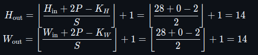

# MLP (Multi-Layer Perceptron)

By Braulio Nayap Maldonado Casilla

## Introducción

El **MLP (Perceptrón Multicapa)** es un tipo de red neuronal artificial compuesta por múltiples capas de neuronas organizadas jerárquicamente. A diferencia del perceptrón simple, el MLP puede aprender representaciones no lineales gracias a sus capas ocultas y al uso de funciones de activación no lineales como la sigmoide, la ReLU o la tangente hiperbólica. Estas características lo hacen especialmente adecuado para resolver problemas complejos como la clasificación no lineal, por ejemplo, el problema clásico de la compuerta XOR.

---

## Implementación en C++

### Clase Neuron

La clase `Neuron` es responsable de representar una neurona en una red neuronal, manejando los pesos (weights), el sesgo, y una función de activación (en este caso usaremos escalón por defecto).

```cpp
class Neuron
{
private:
    std::vector<float> weights;
    float sesgo;
    std::function<float(float)> activation;

public:
    Neuron() = default;
    Neuron(int n_inputs, std::function<float(float)> activation_func);
    void set_weights(const std::vector<float> &new_weights);
    float get_weight(int id) const;
    std::vector<float> get_weights() const;
    void set_sesgo(float new_sesgo);
    float get_sesgo() const;

    // Update Values
    void update_weights(const std::vector<float> &inputs, float err, float lr);
    float forward(const std::vector<float> &inputs);
};
```

#### Constructor

Inicializa los pesos en base a la cantidad de entradas y el sesgo de la neurona, y la personalización de la función de activación (por defecto se utiliza la función escalón).

```cpp
Neuron::Neuron(int n_inputs, std::function<float(float)> activation_func)
{
    if (n_inputs <= 0)
        throw std::invalid_argument("Number of inputs must be positive");
    weights.resize(n_inputs, 0);
    sesgo = 0.0f;
    activation = activation_func ? activation_func : [](float x)
    { return x >= 0 ? 1.0f : 0.0f; };
}
```

#### Métodos GET y SET

- `set_weights`: Establece un nuevo conjunto de pesos.
  ```cpp
    void Neuron::set_weights(const std::vector<float> &new_weights)
    {
        if (new_weights.size() != weights.size())
            throw std::invalid_argument("Size of weights /= n inputs");
        weights = new_weights;
    }
  ```
- `get_weight`: Obtiene el peso en una posición específica.

  ```cpp
    float Neuron::get_weight(int id) const
    {
        if (id < 0 || id >= weights.size())
            throw std::out_of_range("Id out of range");
        return weights[id];
    }
  ```

- `get_weights`: Devuelve todos los pesos en un vector.

  ```cpp
    std::vector<float> Neuron::get_weights() const
    {
        return weights;
    }
  ```

- `set_sesgo`: Establece el valor del sesgo.

  ```cpp
    void Neuron::set_sesgo(float new_sesgo)
    {
        sesgo = new_sesgo;
    }
  ```

- `get_sesgo`: Obtiene el valor del sesgo.

  ```cpp
    float Neuron::get_sesgo() const
    {
        return sesgo;
    }
  ```

#### Función de actualización de pesos

Recibe los valores de entrada, el error (diferencia entre la salida esperada y la salida real) y la tasa de aprendizaje del entrenamiento realizado en una epoch. Con ello se ajustan los pesos y el sesgo de acuerdo con la regla de actualización de perceptrón (regla delta):

**Regla Delta:** Para cada peso w_i:



Y para el sesgo b:


```cpp
void Neuron::update_weights(const std::vector<float> &inputs, float err, float lr)
{
    if (inputs.size() != weights.size())
        throw std::invalid_argument("Size of inputs /= n inputs");
    for (size_t i = 0; i < weights.size(); i++)
        weights[i] += lr * err * inputs[i];
    sesgo += lr * err;
}
```

#### Función Forward (Propagación hacia Adelante)

Calcula la salida de la neurona dados los valores de entrada. La salida se obtiene realizando la suma ponderada de las entradas (producto de cada entrada por su peso respectivo), añadiendo el sesgo y pasando el resultado a través de la función de activación (como en la formula de la Introducción):

```cpp
float Neuron::forward(const std::vector<float> &inputs)
{
    if (inputs.size() != weights.size())
        throw std::invalid_argument("Size of inputs /= n inputs");
    float a = sesgo;
    for (size_t i = 0; i < weights.size(); i++)
        a += weights[i] * inputs[i];
    return activation(a);
}
```

---

### Clase Dataset

Permite cargar conjuntos de datos desde un archivo de texto y proporciona acceso seguro a las matrices de entradas (`X`) y salidas esperadas (`y`), facilitando la generación autónoma de entrenamiento, sin depender de modificaciones internas del código.

```cpp
class Dataset
{
private:
    std::vector<std::vector<float>> X;
    std::vector<float> y;

public:
    Dataset(const std::string &filename);
    const std::vector<std::vector<float>> &get_X() const;
    const std::vector<float> &get_y() const;
};
```

#### Constructor

Recibe un archivo como entrada y con ese archivo logra recibir en la primera linea `n_inputs` y `n_options`, para conocer cuantas entradas se haran y cuantas opciones de mezcla hay. Luego genera las dos listas de entradas y salidas esperadas que estan en las siguientes líneas.

Ejemplo de archivo `OR.txt`:

```bash
2 4
0 0 0
0 1 1
1 0 1
1 1 1
```

```cpp
Dataset::Dataset(const std::string &filename)
{
    std::ifstream file(filename);
    if (!file.is_open())
        throw std::runtime_error("Cant open file: " + filename);

    int n_inputs, n_options;
    file >> n_inputs >> n_options;
    if (n_inputs < 1 || n_options < 1)
        throw std::runtime_error("Invalid number of inputs or options in file: " + filename);
    X.clear();
    y.clear();

    for (size_t i = 0; i < n_options; i++)
    {
        float output;
        std::vector<float> row(n_inputs);
        for (size_t j = 0; j < n_inputs; j++)
            file >> row[j];
        file >> output;
        X.push_back(row);
        y.push_back(output);
    }
    file.close();
}
```

#### Métodos GET

- `get_X`: Retorna la lista X

```cpp
const std::vector<std::vector<float>> &Dataset::get_X() const
{
    return X;
}
```

- `get_t`: Retorna la lista y

```cpp
const std::vector<float> &Dataset::get_y() const
{
    return y;
}
```

---

### Clase `Layer`

Representa una **capa completa de neuronas** dentro de una red neuronal. Cada capa se compone de múltiples instancias de la clase `Neuron` y administra tanto la propagación hacia adelante (_forward_) como hacia atrás (_backward_), así como la actualización de los pesos en función de los errores y la tasa de aprendizaje. Se almacenarán las funciones para activación, las entradas, los resultados antes de la activación y la lista de neuronas.

```cpp

class Layer
{
private:
    std::vector<Neuron> neurons;
    std::function<float(float)> activation;
    std::function<float(float)> activation_derivative;
    std::vector<float> last_input;
    std::vector<float> last_z;

public:
    Layer() = default;
    Layer(int n_neurons, int n_inputs_per_neuron,
          std::function<float(float)> act,
          std::function<float(float)> act_deriv);
    void load_layer(int n_neurons, int n_inputs_per_neuron,
                    std::function<float(float)> act,
                    std::function<float(float)> act_deriv,
                    const std::vector<std::vector<float>> &all_weights,
                    const std::vector<float> &all_biases);
    std::vector<float> forward(const std::vector<float> &inputs);
    std::vector<float> backward(const std::vector<float> &deltas_next,
                                const std::vector<std::vector<float>> &weights_next);
    void update_weights(float lr, const std::vector<float> &deltas);
    const std::vector<float> &get_last_input() const;
    const std::vector<float> &get_last_z() const;
    const std::vector<Neuron> &get_neurons() const;
    std::function<float(float)> get_activation_derivative() const { return activation_derivative; }
};
```

#### Constructor

Inicializa una capa con `n` neuronas, cada una con `n_inputs_per_neuron` entradas. Asocia la función de activación y su derivada para utilizar en los procesos de propagación directa e inversa.

```cpp
Layer::Layer(int n_neurons, int n_inputs_per_neuron,
             std::function<float(float)> act,
             std::function<float(float)> act_deriv)
    : activation(act), activation_derivative(act_deriv)
{
    for (int i = 0; i < n_neurons; ++i)
        neurons.emplace_back(n_inputs_per_neuron, activation);
}
```

#### Método `load_layer`

Este método permite **cargar pesos y sesgos específicos** a cada neurona de la capa, útil para inicializar una red previamente entrenada o reproducir experimentos.

```cpp
void Layer::load_layer(int n_neurons, int n_inputs_per_neuron,
                       std::function<float(float)> act,
                       std::function<float(float)> act_deriv,
                       const std::vector<std::vector<float>> &all_weights = {},
                       const std::vector<float> &all_biases = {})
{
    activation = act;
    activation_derivative = act_deriv;
    neurons.clear();
    neurons.reserve(n_neurons);
    for (int i = 0; i < n_neurons; ++i)
    {
        neurons.emplace_back(n_inputs_per_neuron, act);
        if (!all_weights.empty() && i < (int)all_weights.size())
            neurons.back().set_weights(all_weights[i]);
        if (!all_biases.empty() && i < (int)all_biases.size())
            neurons.back().set_sesgo(all_biases[i]);
    }
    last_input.clear();
    last_z.clear();
}
```

#### Función `forward`

Realiza la **propagación hacia adelante**, calculando la salida de cada neurona de la capa. Para cada neurona:

1. Calcula `z = w · x + b` (producto punto más sesgo).
2. Aplica la función de activación `f(z)` y guarda el resultado.

También guarda el `input` y los valores `z` sin activar, que serán usados en el retropropagado (`backward()`).

```cpp
std::vector<float> Layer::forward(const std::vector<float> &inputs)
{
    last_input = inputs;
    last_z.clear();
    std::vector<float> outputs;
    for (auto &n : neurons)
    {
        float z = 0.0f;
        auto weights = n.get_weights();
        for (size_t i = 0; i < weights.size(); ++i)
            z += weights[i] * inputs[i];
        z += n.get_sesgo();
        last_z.push_back(z);
        outputs.push_back(activation(z));
    }
    return outputs;
}
```

#### Función `backward`

Implementa la **retropropagación del error**, que calcula los gradientes locales de esta capa basándose en el error proveniente de la siguiente capa.

Para cada neurona `i` en esta capa:

- Se calcula la suma ponderada de los errores de la siguiente capa.
- Se multiplica por la derivada de la función de activación evaluada en `z_i`.

Devuelve un vector con los **errores (deltas)** para cada neurona, que serán utilizados para actualizar los pesos.

```cpp
std::vector<float> Layer::backward(const std::vector<float> &deltas_next,
                                   const std::vector<std::vector<float>> &weights_next)
{
    std::vector<float> deltas(neurons.size(), 0.0f);
    for (size_t i = 0; i < neurons.size(); ++i)
    {
        float sum = 0.0f;
        for (size_t j = 0; j < deltas_next.size(); ++j)
            sum += weights_next[j][i] * deltas_next[j];
        deltas[i] = sum * activation_derivative(last_z[i]);
    }
    return deltas;
}
```

#### Función `update_weights`

Actualiza los pesos y sesgos de cada neurona usando la regla delta:


Donde:

- `n` es la tasa de aprendizaje `lr`
- `delta_i` es el error de la neurona
- `x_j` es la entrada `j` correspondiente

El sesgo también se ajusta en cada neurona según


```cpp
void Layer::update_weights(float lr, const std::vector<float> &deltas)
{
    for (size_t i = 0; i < neurons.size(); ++i)
        neurons[i].update_weights(last_input, deltas[i], lr);
}
```

#### Métodos GET

```cpp
const std::vector<float> &get_last_input() const;
const std::vector<float> &get_last_z() const;
const std::vector<Neuron> &get_neurons() const;
```

- `get_last_input`: Devuelve el último vector de entrada a la capa.
- `get_last_z`: Devuelve los valores antes de activación (`z`) de la capa.
- `get_neurons`: Permite acceder directamente a las neuronas, útil para inspeccionar pesos o salidas individuales.

---

### Clase `MLP`

La clase Perceptrón Multicapa representa una red neuronal con múltiples capas completamente conectadas. Su diseño permite especificar el número de capas, neuronas por capa, funciones de activación y derivadas correspondientes, lo que la hace flexible y extensible.

```cpp
class MLP
{
private:
    std::vector<Layer> layers;
    float learning_rate;
    int input_size;
    std::vector<std::function<float(float)>> activations;
    std::vector<std::function<float(float)>> derivatives;

public:
    MLP() = default;
    MLP(const std::vector<int> &sizes,
        const std::vector<std::function<float(float)>> &activations,
        const std::vector<std::function<float(float)>> &derivatives,
        float lr = 0.1);

    std::vector<float> predict(const std::vector<float> &input);
    void train(const std::vector<std::vector<float>> &X,
               const std::vector<std::vector<float>> &Y,
               float min_error = 0.001f,
               bool print = false,
               const std::string &dataset_filename = "databaese.txt");
    float mse(const std::vector<float> &pred, const std::vector<float> &target);
    void backpropagate(const std::vector<float> &output,
                       const std::vector<float> &target,
                       std::vector<std::vector<float>> &all_deltas);
    float train_epoch(const std::vector<std::vector<float>> &X, const std::vector<std::vector<float>> &Y);
    void log_epoch(std::ofstream &log_file, int epoch, float mse_avg);
    void save_final_weights(const std::string &path);
    void print_weights(int epoch, float mse_avg);
    bool load_from_file(const std::string &filename);
};
```

#### Constructor

Inicializa la red neuronal con una lista de tamaños por capa (`sizes`), funciones de activación, derivadas y una tasa de aprendizaje (`learning_rate`). Verifica que haya al menos una capa de entrada y una de salida, y que el número de funciones de activación coincida con el de capas ocultas/salida.

```cpp
MLP::MLP(const std::vector<int> &sizes,
         const std::vector<std::function<float(float)>> &activations,
         const std::vector<std::function<float(float)>> &derivatives,
         float lr)
    : learning_rate(lr), activations(activations), derivatives(derivatives),
      input_size(sizes[0])
{
    if (sizes.size() < 2 || activations.size() != sizes.size() - 1)
        throw std::invalid_argument("Invalid layer or activation sizes");
    for (size_t i = 1; i < sizes.size(); ++i)
        layers.emplace_back(Layer(sizes[i], sizes[i - 1], activations[i - 1], derivatives[i - 1]));
}
```

#### Método `predict`

Realiza una inferencia hacia adelante (forward pass) sobre la red, aplicando cada capa secuencialmente a la entrada hasta obtener la salida.

```cpp
std::vector<float> MLP::predict(const std::vector<float> &input)
{
    std::vector<float> output = input;
    for (auto &layer : layers)
        output = layer.forward(output);
    return output;
}
```

#### Método `mse` (Error Cuadrático Medio)

Calcula el error cuadrático medio entre la salida predicha y la salida esperada, para evaluar el desempeño de la red durante el entrenamiento.

```cpp
float MLP::mse(const std::vector<float> &pred, const std::vector<float> &target)
{
    float sum = 0.0f;
    for (size_t i = 0; i < pred.size(); ++i)
        sum += (pred[i] - target[i]) * (pred[i] - target[i]);
    return sum / pred.size();
}
```

#### Método `backpropagate`

Realiza la propagación hacia atrás (backpropagation) del error desde la capa de salida hacia las capas anteriores, utilizando la derivada de la función de activación de cada neurona. Calcula los **deltas** necesarios para la actualización de pesos.

```cpp
void MLP::backpropagate(const std::vector<float> &output,
                        const std::vector<float> &target,
                        std::vector<std::vector<float>> &all_deltas)
{
    std::vector<float> delta_output(output.size(), 0.0f);
    const auto &z_out = layers.back().get_last_z();
    auto act_deriv = layers.back().get_activation_derivative();
    for (size_t j = 0; j < output.size(); ++j)
        delta_output[j] = (target[j] - output[j]) * act_deriv(z_out[j]);

    all_deltas.back() = delta_output;

    for (int l = layers.size() - 2; l >= 0; --l)
    {
        std::vector<std::vector<float>> next_weights;
        for (const auto &n : layers[l + 1].get_neurons())
            next_weights.push_back(n.get_weights());

        all_deltas[l] = layers[l].backward(all_deltas[l + 1], next_weights);
    }
}
```

#### Método `train_epoch`

Ejecuta una época completa del entrenamiento: realiza forward, backpropagation y actualiza los pesos para cada muestra. Devuelve el error promedio de la época.

```cpp
float MLP::train_epoch(const std::vector<std::vector<float>> &X,
                       const std::vector<std::vector<float>> &Y)
{
    float error_total = 0.0f;
    for (size_t i = 0; i < X.size(); ++i)
    {
        std::vector<float> output = predict(X[i]);
        std::vector<std::vector<float>> all_deltas(layers.size());
        backpropagate(output, Y[i], all_deltas);
        for (size_t l = 0; l < layers.size(); ++l)
            layers[l].update_weights(learning_rate, all_deltas[l]);
        error_total += mse(output, Y[i]);
    }
    return error_total / X.size();
}
```

#### Método `train`

Realiza el ciclo completo de entrenamiento por épocas. Guarda los resultados de cada época en un archivo de log y permite detener el entrenamiento automáticamente cuando el error cae por debajo de un umbral.

```cpp
void MLP::train(const std::vector<std::vector<float>> &X,
                const std::vector<std::vector<float>> &Y,
                float min_error, bool print,
                const std::string &dataset_filename)
{
    std::string base_name = std::filesystem::path(dataset_filename).stem().string();
    std::filesystem::path output_dir = std::filesystem::path("output") / base_name;
    std::filesystem::create_directories(output_dir);
    std::ofstream log_file(output_dir / "log.txt");

    int e = 0;
    while (true)
    {
        float mse_avg = train_epoch(X, Y);
        log_epoch(log_file, e, mse_avg);
        if (print)
            print_weights(e, mse_avg);
        if (mse_avg < min_error)
        {
            std::cout << "Training stopped at epoch " << e
                      << " with MSE: " << mse_avg << "\n";
            break;
        }
        e++;
    }
    log_file.close();
    save_final_weights((output_dir / "final.txt").string());
}
```

#### Métodos auxiliares

##### `log_epoch`

Registra la información de cada época en un archivo de log.

```cpp
void MLP::log_epoch(std::ofstream &log_file, int epoch, float mse_avg)
{
    log_file << "Epoch " << epoch << " - MSE: " << mse_avg << "\n";
}
```

##### `save_final_weights`

Guarda los pesos y sesgos finales de cada neurona en un archivo plano, junto con la estructura de la red y funciones de activación.

```cpp
void MLP::save_final_weights(const std::string &path)
{
    std::ofstream final_file(path);
    //...
}
```

##### `print_weights`

Imprime en consola los pesos y sesgos de cada neurona por capa, útil para depuración.

```cpp
void MLP::print_weights(int epoch, float mse_avg)
{
    std::cout << "Epoch " << epoch << " - MSE: " << mse_avg << "\n";
    // Itera e imprime pesos y sesgos
}
```

##### `load_from_file`

Carga una red previamente entrenada desde un archivo que contenga la arquitectura, tasa de aprendizaje, funciones de activación y pesos.

```cpp
bool MLP::load_from_file(const std::string &filename)
{
    std::ifstream file(filename);
    // Extrae arquitectura, tasa de aprendizaje y pesos desde archivo plano
}
```

---

### Activaciones y Derivadas

Este archivo define un conjunto de **funciones de activación** comunes utilizadas en redes neuronales, junto con sus respectivas **derivadas**, que son esenciales para el cálculo del gradiente durante la propagación hacia atrás (_backpropagation_). Además, proporciona mecanismos para asociar nombres con las funciones usando `std::unordered_map`, lo cual es útil para guardar y cargar redes desde archivos.

#### 1. Sigmoide

La función sigmoide es una función suave que transforma cualquier número real en el rango (0, 1), lo cual la hace útil para problemas de clasificación binaria.

```cpp
inline float sigmoid(float x)
{
    return 1.0f / (1.0f + exp(-x));
}
```

Su derivada se expresa en función del resultado de la sigmoide, lo cual mejora el rendimiento computacional:

```cpp
inline float sigmoid_derivative(float x)
{
    float s = sigmoid(x);
    return s * (1.0f - s);
}
```

#### 2. ReLU (Unidad Lineal Rectificada)

La función ReLU es ampliamente usada por su simplicidad y eficiencia. Actúa como una compuerta que solo deja pasar valores positivos.

```cpp
inline float relu(float x)
{
    return x > 0 ? x : 0;
}

inline float relu_derivative(float x)
{
    return x > 0 ? 1.0f : 0.0f;
}
```

#### 3. Tangente hiperbólica (`tanh`)

La función tangente hiperbólica es similar a la sigmoide pero con salida en el rango (-1, 1), lo que puede mejorar la convergencia en ciertas redes neuronales profundas.

```cpp
inline float tanh_fn(float x)
{
    return std::tanh(x);
}

inline float tanh_derivative(float x)
{
    float t = std::tanh(x);
    return 1.0f - t * t;
}
```

---

#### Mapas de funciones

Estos mapas permiten registrar funciones por su nombre, facilitando la serialización de redes y su reconstrucción desde archivos:

```cpp
inline std::unordered_map<std::string, std::function<float(float)>> activation_map = {
    {"sigmoid", sigmoid},
    {"relu", relu},
    {"tanh", tanh_fn}
};

inline std::unordered_map<std::string, std::function<float(float)>> derivative_map = {
    {"sigmoid", sigmoid_derivative},
    {"relu", relu_derivative},
    {"tanh", tanh_derivative}
};
```

#### Recuperación de nombre de función

Estas funciones permiten identificar el nombre asociado a una función de activación o derivada. Esto es útil para guardar la red en disco incluyendo el nombre de cada función.

```cpp
inline std::string get_activation_name(const std::function<float(float)> &func)
{
    auto ptr = func.target<float (*)(float)>();
    if (ptr && *ptr == sigmoid) return "sigmoid";
    else if (ptr && *ptr == relu) return "relu";
    else if (ptr && *ptr == tanh_fn) return "tanh";
    else return "unknown";
}

inline std::string get_derivative_name(const std::function<float(float)> &func)
{
    auto ptr = func.target<float (*)(float)>();
    if (ptr && *ptr == sigmoid_derivative) return "sigmoid";
    else if (ptr && *ptr == relu_derivative) return "relu";
    else if (ptr && *ptr == tanh_derivative) return "tanh";
    else return "unknown";
}
```

---

### Ejecutable Train `main_train.cpp`

Se encarga de ejecutar el entrenamiento con un archivo de database.

#### 1. Carga del dataset

Se recibe como parametro el archivo del dataset.txt y este lo carga con la clase `Dataset`, que luego se podra retornar solicitando la lista de entradas y salidas esperadas.

```cpp
std::string dataset_file = argv[1];
Dataset dataset(dataset_file);
std::vector<std::vector<float>> X = dataset.get_X();
std::vector<float> y = dataset.get_y();
```

#### 2. Conversión de etiquetas

Convierte las etiquetas escalares (`float`) en vectores de tamaño 1 para que coincidan con el formato esperado por el MLP (`std::vector<std::vector<float>>`).

```cpp
std::vector<std::vector<float>> Y;
for (float v : y_scalar)
    Y.push_back({v});
```

#### 3. Configuración del modelo

Declaramos las variables de cantidad de entradas según el dataset, las funciones de activacion y sus derivadas, y los layers (capa de entrada, 1 capa oculta con 2 neuronas, capa de salida).

```cpp
int n_inputs = X[0].size();
std::vector<std::function<float(float)>> activations = {sigmoid, relu};
std::vector<std::function<float(float)>> derivatives = {sigmoid_derivative, relu_derivative};
std::vector<int> layers = {n_inputs, 2, 1};
```

#### 4. Instanciación y entrenamiento del MLP

Se crea una red `MLP` con tasa de aprendizaje 0.01, y se entrena hasta que el error sea menor que `0.0001`.

```cpp
MLP mlp(layers, activations, derivatives, 0.01f);
std::cout << "Entrenando MLP..." << std::endl;
mlp.train(X, Y, 0.0001f, false, dataset_file);
```

#### 5. Evaluación del modelo

Para cada entrada `X[i]`, se calcula una predicción `pred[0]`. Se muestra:

- Los valores de entrada.
- El valor predicho y su clase binaria (0 o 1, usando un umbral de 0.5).
- El valor esperado original.

```cpp
std::cout << "Predicciones:\n";
for (size_t i = 0; i < X.size(); ++i)
{
    std::vector<float> pred = mlp.predict(X[i]);
    std::cout << "(";
    for (float val : X[i])
        std::cout << val << " ";
    std::cout << ") => " << pred[0] << " ≈ " << (pred[0] > 0.5f ? 1 : 0) << " (esperado: " << Y[i][0] << ")\n";
}
```

---

### Ejecutable Test `main_test.cpp`

Se encarga de ejecutar el perceptron pero permite cargar los pesos y realizar una consulta para obtener una salida.

#### 1. Lectura de entradas y archivo

Recibe dos parametros que serán numero flotantes y estos serán los inputs de la consulta y el tercer parametro será el archivo del cuál se cargaran los pesos ya entrenados.

```cpp
float x1 = std::stof(argv[1]);
float x2 = std::stof(argv[2]);
std::string filename = argv[3];
```

#### 2. Carga del modelo

Se crea un objeto `MLP` sin entrenar, y se carga toda la configuración pesos previamente netrenados desde `filename`, si falla la carga, se informa el error.

```cpp
MLP mlp;
if (!mlp.load_from_file(filename))
{
    std::cerr << "Error: Could not load MLP from file: " << filename << std::endl;
    return 1;
}
```

#### 3. Impresión de confirmación

Se indica que la red fue cargada correctamente y para comprobarlo se imprimen los pesos actuales.

```cpp
std::cout << "MLP loaded successfully from " << filename << std::endl;
mlp.print_weights(0, 0.0f);
```

#### 4. Predicción

Se forma un vector de entrada con `x1` y `x2`, y se realiza la predicción usando el método `predict` del MLP.

```cpp
std::vector<std::vector<float>> X = {{x1, x2}};
std::vector<float> pred = mlp.predict(X[0]);
```

#### 5. Salida de resultados

Se muestra la predicción calculada y se binariza para la respuesta.

```cpp
std::cout << "Predictions:\n";
std::cout << "(";
for (float val : X[0])
    std::cout << val << " ";
std::cout << ") => " << pred[0] << " ≈ " << (pred[0] > 0.5f ? 1 : 0) << "\n";
```

### Ejecución

Con este comando se generará la carpeta `build` y dentro estarán los dos ejecutables `mlp_test` y `mlp_train`.

```bash
make run
```

#### Ejecución de Entrenamiento

```bash
./build/mlp_train ./database/[name].txt
```

#### Ejecución de Test o Consulta

```bash
./build/mlp_test 1 1 ./output/[name]/final.txt
```

### Salida


#### Ejecución de Entrenamiento


#### Ejecución de Test


## Implementación en Python

Este script en Python sirve para **visualizar cómo disminuye el error cuadrático medio (MSE)** durante el entrenamiento de una red neuronal para distintos conjuntos de datos: `XOR`, `AND` y `OR`. Es útil para analizar el **progreso del aprendizaje del modelo a lo largo de las épocas**.

### 1. Función `cargar_mse_por_epoch(path)`

Lee un archivo de log línea por línea, extrayendo las épocas (`Epoch X`) y el MSE reportado en esa línea.

Ejemplo de línea válida:

```
Epoch 35 - MSE: 0.004563
```

```python
def cargar_mse_por_epoch(path):
    epochs = []
    mses = []
    with open(path, 'r') as f:
        for line in f:
            match = re.match(r"Epoch\s+(\d+)\s+-\s+MSE:\s+([0-9.eE+-]+)", line)
            if match:
                epochs.append(int(match.group(1)))
                mses.append(float(match.group(2)))
    return epochs, mses
```

#### 3. Graficado con Matplotlib

Carga los datos y los grafica usando la escala logarítmica en el eje Y para resaltar mejoras pequeñas.

```python
fig, axs = plt.subplots(1, 3, figsize=(18, 5))
...
```

### Utilidad

- Diagnóstico visual: ayuda a detectar si el modelo está aprendiendo bien o si hay problemas (como sobreajuste o estancamiento).
- Comparación de rendimientos entre diferentes configuraciones o funciones de activación.
- Confirmar que el modelo converge (baja del MSE constante).

---

### Ejecución

Después de ejecutar el entrenamiento de AND, OR y XOR con C++, podremos ejecutar esto.

```bash
python graphic.py
```

### Salida

Este es el Gráfico de comparación entre XOR, AND y OR con las mismas funciones de activación.


Y este el gráfico de comparación entre 5 combinaciones de las 9 posibles para XOR.


## Conclusiones

Los resultados del entrenamiento mostraron que, para problemas simples como AND y OR, el perceptrón fue más eficiente, logrando converger en solo 4 épocas con resultados correctos. En cambio, aunque el MLP alcanzó una alta precisión (MSE ≈ 1e-4), requirió muchas más épocas, especialmente para OR (casi 450,000), lo que reflejó una menor eficiencia en estos casos. Sin embargo, el MLP, con su arquitectura más compleja y funciones de activación como Sigmoide–ReLU, ofreció mayor flexibilidad y fue más adecuado para problemas no lineales.

Otra observación fue que, al entrenar la red MLP con cinco combinaciones de funciones de activación para resolver XOR, se encontró que las configuraciones ReLU en la capa oculta con Sigmoide en la salida, Sigmoide en ambas capas, y Sigmoide en la oculta con ReLU en la salida fueron las más efectivas, logrando un MSE menor a 1e-4. Destacó la combinación Sigmoide–ReLU por su rápida convergencia en solo 17,171 épocas. La combinación Sigmoide–Tanh también funcionó, pero requirió más del doble de épocas, mientras que Tanh–Sigmoide no logró un error satisfactorio incluso tras 4 millones de épocas.

## Author

- **ShinjiMC** - [GitHub Profile](https://github.com/ShinjiMC)

## License

This project is licensed under the MIT License. See the [LICENSE](LICENSE) file for details.
