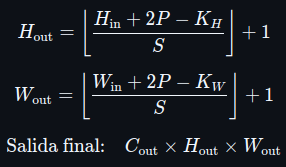
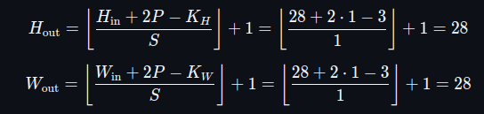

# Convolutional Neural Network - Convolutional

By Braulio Nayap Maldonado Casilla

## Introducción

La convolución es una operación matemática fundamental en el procesamiento de imágenes y en las redes neuronales convolucionales (CNN, por sus siglas en inglés). Esta operación permite extraer patrones locales de una entrada multidimensional, como bordes, texturas o estructuras complejas, mediante el uso de filtros o kernels que se deslizan sobre la imagen de entrada.

En el contexto de las CNN, una convolución consiste en aplicar un conjunto de filtros sobre una entrada (típicamente una imagen con varios canales), generando como resultado una nueva representación llamada mapa de características (feature map). Cada filtro es un pequeño tensor de pesos entrenables que se ajustan durante el aprendizaje para detectar patrones específicos.

### Fórmula de la convolución discreta 2D

La salida en la posición (i, j) del canal de salida c_out, aplicando una convolución sobre una entrada multicanal, se calcula como:


| Símbolo              | Significado                                                  |
| -------------------- | ------------------------------------------------------------ |
| Y_c_out (i, j)       | Valor en la posición (i,j) del canal de salida c_out         |
| X_c_in (i,j)         | Valor en la posición (i,j) del canal de entrada c_in         |
| K_c_out, c_in (m, n) | Valor del kernel que conecta c_in => c_out en posición (m,n) |
| b_c_out              | Sesgo (bias) correspondiente al canal de salida c_out        |
| S                    | Stride (paso de desplazamiento)                              |
| P                    | Padding (relleno con ceros alrededor de la entrada)          |
| C_in                 | Número de canales de entrada                                 |
| C_out                | Número de filtros / canales de salida                        |
| K_H, K_W             | Altura y ancho del kernel                                    |

### Fórmulas para calcular el tamaño de salida de la convolución

Dada una entrada tridimensional de tamaño:


y una convolución definida por:

- Kernel de tamaño K_H x K_W
- Stride S
- Padding P
- Número de filtros C_out

El tamaño de la salida será:



| Símbolo | Significado                                       |
| ------- | ------------------------------------------------- |
| C_in    | Número de canales de la entrada (ej. 3 si es RGB) |
| H_in    | Altura (filas) de la entrada                      |
| W_in    | Ancho (columnas) de la entrada                    |
| K_H     | Altura del kernel (filtro)                        |
| K_W     | Ancho del kernel (filtro)                         |
| P       | Padding (número de ceros añadidos en los bordes)  |
| S       | Stride (paso con el que se desplaza el filtro)    |
| C_out   | Número de filtros (canales de salida)             |
| H_out   | Altura del mapa de características de salida      |
| W_out   | Ancho del mapa de características de salida       |
| ⌊⌋      | Parte entera inferior (redondeo hacia abajo)      |

---

## Implementación en C++

### Clase `Conv2D`

La clase `Conv2D` representa una capa convolucional tridimensional utilizada en redes neuronales convolucionales. Implementa tanto la propagación hacia adelante (`forward`) como hacia atrás (`backward`) para aprendizaje supervisado. Esta clase admite entrada 3D con múltiples canales (por ejemplo, RGB) y soporta parámetros como padding y stride. Los filtros se inicializan aleatoriamente y se aplican sobre la entrada para generar mapas de activación.

```cpp
class Conv2D
{
private:
    int in_channels, out_channels;
    int kernel_h, kernel_w;
    int stride, padding;
    std::vector<std::vector<std::vector<std::vector<double>>>> filters;
    std::vector<double> biases;
    std::vector<std::vector<std::vector<std::vector<double>>>> d_filters;
    std::vector<double> d_biases;
    std::vector<std::vector<std::vector<double>>> last_input;
    std::vector<std::vector<std::vector<double>>> pad_input(
        const std::vector<std::vector<std::vector<double>>> &input);
    void initialize_filters();

public:
    Conv2D(int in_channels, int out_channels, int kernel_h, int kernel_w,
           int stride = 1, int padding = 0);
    std::vector<std::vector<std::vector<double>>> forward(
        const std::vector<std::vector<std::vector<double>>> &input);
    std::vector<std::vector<std::vector<double>>> backward(
        const std::vector<std::vector<std::vector<double>>> &grad_output);
};
```

#### Constructor `Conv2D`

Inicializa la capa convolucional con los parámetros:

- `in_channels`: número de canales de entrada.
- `out_channels`: número de filtros.
- `kernel_h`, `kernel_w`: altura y anchura del kernel.
- `stride`: paso con el que se aplica el filtro (por defecto 1).
- `padding`: número de ceros añadidos a los bordes (por defecto 0).

Este constructor llama internamente a `initialize_filters()` para inicializar aleatoriamente los pesos y los sesgos de cada filtro.

```cpp
Conv2D::Conv2D(int in_channels, int out_channels, int kernel_h, int kernel_w,
               int stride, int padding)
    : in_channels(in_channels), out_channels(out_channels),
      kernel_h(kernel_h), kernel_w(kernel_w),
      stride(stride), padding(padding)
{
    initialize_filters();
}
```

#### Método `initialize_filters()`

Inicializa todos los pesos de los filtros con una distribución uniforme en el rango [-1.0, 1.0] usando `std::mt19937`. También inicializa los sesgos con valores aleatorios independientes.

```cpp
void Conv2D::initialize_filters()
{
    std::random_device rd;
    std::mt19937 gen(rd());
    std::uniform_real_distribution<double> dis(-1.0, 1.0);

    filters.resize(out_channels, std::vector<std::vector<std::vector<double>>>(
                                     in_channels, std::vector<std::vector<double>>(
                                                      kernel_h, std::vector<double>(kernel_w))));
    biases.resize(out_channels, 0.0);
    for (int oc = 0; oc < out_channels; ++oc)
    {
        for (int ic = 0; ic < in_channels; ++ic)
            for (int i = 0; i < kernel_h; ++i)
                for (int j = 0; j < kernel_w; ++j)
                    filters[oc][ic][i][j] = dis(gen);
        biases[oc] = dis(gen);
    }
}
```

#### Método `pad_input(...)`

Aplica padding cero alrededor de la imagen de entrada. Si el padding es 0, simplemente devuelve la imagen original. Se utiliza tanto en el `forward` como en el `backward`.

```cpp
std::vector<std::vector<std::vector<double>>> Conv2D::pad_input(
    const std::vector<std::vector<std::vector<double>>> &input)
{
    int h = input[0].size();
    int w = input[0][0].size();
    int padded_h = h + 2 * padding;
    int padded_w = w + 2 * padding;

    std::vector<std::vector<std::vector<double>>> padded_input(in_channels,
                                                               std::vector<std::vector<double>>(padded_h, std::vector<double>(padded_w, 0.0)));
    for (int c = 0; c < in_channels; ++c)
        for (int i = 0; i < h; ++i)
            for (int j = 0; j < w; ++j)
                padded_input[c][i + padding][j + padding] = input[c][i][j];
    return padded_input;
}
```

#### Método `forward(...)`

- Recibe una entrada tridimensional con forma `[C_in][H_in][W_in]`, donde:

  - `C_in`: número de canales de entrada.
  - `H_in`: altura de la imagen.
  - `W_in`: ancho de la imagen.

- Se guarda la entrada original (sin padding) en `last_input` para su uso posterior en la función `backward`.

- Si `padding > 0`, se aplica **padding con ceros** mediante la función `pad_input`, lo que incrementa las dimensiones espaciales de la entrada.

- Se calcula el tamaño de salida `H_out` y `W_out` usando las fórmulas estándar de convolución (considerando stride y padding).

- Se inicializa un tensor de salida con forma `[C_out][H_out][W_out]`, donde `C_out` es el número de filtros.

- Para cada filtro (`out_channel`), se realiza:

  - Una operación de convolución sobre cada región de la entrada desplazándose con el `stride`.
  - En cada región:

    - Se toma una **ventana** de tamaño igual al kernel.
    - Se realiza el **producto punto** entre los valores de la ventana y los pesos del filtro.
    - Se suma el **bias** correspondiente.
    - El resultado se guarda en la posición correspondiente del tensor de salida.

- Se repite el proceso para todos los filtros, obteniendo una salida final con `C_out` mapas de activación.

```cpp
std::vector<std::vector<std::vector<double>>> Conv2D::forward(
    const std::vector<std::vector<std::vector<double>>> &input)
{
    last_input = input;
    auto padded = (padding > 0) ? pad_input(input) : input;
    int h = padded[0].size();
    int w = padded[0][0].size();
    int out_h = (h - kernel_h) / stride + 1;
    int out_w = (w - kernel_w) / stride + 1;
    std::vector<std::vector<std::vector<double>>> output(out_channels,
                                                         std::vector<std::vector<double>>(out_h, std::vector<double>(out_w, 0.0)));
    for (int oc = 0; oc < out_channels; ++oc)
        for (int i = 0; i < out_h; ++i)
            for (int j = 0; j < out_w; ++j)
            {
                double sum = biases[oc];
                for (int ic = 0; ic < in_channels; ++ic)
                {
                    for (int ki = 0; ki < kernel_h; ++ki)

                        for (int kj = 0; kj < kernel_w; ++kj)
                        {
                            int xi = i * stride + ki;
                            int xj = j * stride + kj;
                            sum += padded[ic][xi][xj] * filters[oc][ic][ki][kj];
                        }
                }
                output[oc][i][j] = sum;
            }
    return output;
}
```

#### Método `backward(...)`

- Recibe como entrada `grad_output`, que es el gradiente del error con respecto a la salida de la convolución. Tiene forma `[C_out][H_out][W_out]`.

- Si se usó `padding` durante el `forward`, se vuelve a aplicar `pad_input` sobre la entrada guardada (`last_input`) para reconstruir la entrada tal como se usó originalmente.

- Se inicializan:

  - `d_filters`: gradientes de los pesos de cada filtro, con la misma forma que `filters`.
  - `d_biases`: gradientes de los sesgos, uno por filtro.
  - `grad_input`: gradientes respecto a la entrada, con la misma forma que la entrada padded.

- Para cada posición `(i, j)` del gradiente de salida y cada filtro `oc`:

  - Se acumula el gradiente de salida en el sesgo correspondiente:
    `d_biases[oc] += grad_output[oc][i][j]`.

  - Para cada canal de entrada `ic`, y cada posición del kernel `(ki, kj)`:

    - Se calcula la posición correspondiente en la entrada padded:
      `xi = i * stride + ki`,
      `xj = j * stride + kj`.

    - Se actualiza el gradiente del filtro:
      `d_filters[oc][ic][ki][kj] += input[ic][xi][xj] * grad_output[oc][i][j]`.

    - Se actualiza el gradiente respecto a la entrada:
      `grad_input[ic][xi][xj] += filters[oc][ic][ki][kj] * grad_output[oc][i][j]`.

- Si se aplicó padding, se **recorta `grad_input`** eliminando las zonas externas, para devolver solo la parte correspondiente a la entrada original.

- Devuelve `grad_input`, que representa el gradiente del error respecto a la entrada de esta capa. Esto permite propagar el error hacia capas anteriores durante el entrenamiento.

```cpp
std::vector<std::vector<std::vector<double>>> Conv2D::backward(
    const std::vector<std::vector<std::vector<double>>> &grad_output)
{
    auto input = (padding > 0) ? pad_input(last_input) : last_input;

    int in_h = input[0].size();
    int in_w = input[0][0].size();
    int out_h = grad_output[0].size();
    int out_w = grad_output[0][0].size();

    d_filters.assign(out_channels,
                     std::vector<std::vector<std::vector<double>>>(in_channels,
                                                                   std::vector<std::vector<double>>(kernel_h,
                                                                                                    std::vector<double>(kernel_w, 0.0))));
    d_biases.assign(out_channels, 0.0);
    std::vector<std::vector<std::vector<double>>> grad_input(in_channels,
                                                             std::vector<std::vector<double>>(in_h, std::vector<double>(in_w, 0.0)));
    for (int oc = 0; oc < out_channels; ++oc)
        for (int i = 0; i < out_h; ++i)
            for (int j = 0; j < out_w; ++j)
            {
                double grad = grad_output[oc][i][j];
                d_biases[oc] += grad;
                for (int ic = 0; ic < in_channels; ++ic)
                    for (int ki = 0; ki < kernel_h; ++ki)
                        for (int kj = 0; kj < kernel_w; ++kj)
                        {
                            int xi = i * stride + ki;
                            int xj = j * stride + kj;
                            d_filters[oc][ic][ki][kj] += input[ic][xi][xj] * grad;
                            grad_input[ic][xi][xj] += filters[oc][ic][ki][kj] * grad;
                        }
            }
    if (padding > 0)
    {
        std::vector<std::vector<std::vector<double>>> unpadded(in_channels,
                                                               std::vector<std::vector<double>>(in_h - 2 * padding,
                                                                                                std::vector<double>(in_w - 2 * padding)));
        for (int c = 0; c < in_channels; ++c)
            for (int i = 0; i < in_h - 2 * padding; ++i)
                for (int j = 0; j < in_w - 2 * padding; ++j)
                    unpadded[c][i][j] = grad_input[c][i + padding][j + padding];
        return unpadded;
    }
    return grad_input;
}
```

---

### Clase `main.cpp`

#### Función `load_images_from_txt`

Esta función se encarga de leer un archivo de texto que contiene datos normalizados de imágenes, y reconstruirlos en un tensor 4D de la forma `[N][C][H][W]`, donde `N` es el número de imágenes, `C` los canales (por ejemplo 3 para RGB), `H` la altura y `W` el ancho. Cada imagen se compone de `C` bloques de `H` líneas, cada una con `W` valores reales. Esta organización permite convertir imágenes almacenadas en texto plano en tensores listos para ser procesados por capas convolucionales.

```cpp
std::vector<std::vector<std::vector<std::vector<double>>>> load_images_from_txt(
    const std::string &path_txt, int num_images, int channels, int height, int width)
{
    std::ifstream file(path_txt);
    if (!file.is_open())
        throw std::runtime_error("Cannot open file: " + path_txt);
    std::vector<std::vector<std::vector<std::vector<double>>>> images;
    std::string line;
    int line_count = 0;
    std::vector<std::vector<std::vector<double>>> current_image(
        channels, std::vector<std::vector<double>>(height, std::vector<double>(width)));
    while (std::getline(file, line))
    {
        std::istringstream ss(line);
        double val;
        int channel = line_count % channels;
        for (int i = 0; i < height; ++i)
            for (int j = 0; j < width; ++j)
            {
                if (!(ss >> val))
                    throw std::runtime_error("Error reading value at line " + std::to_string(line_count + 1));
                current_image[channel][i][j] = val;
            }
        line_count++;
        if (line_count % channels == 0)
        {
            images.push_back(current_image);
            if (images.size() >= static_cast<size_t>(num_images))
                break;
        }
    }
    if (images.size() != static_cast<size_t>(num_images))
        std::cerr << "Warning: Expected " << num_images << " images, but found " << images.size() << ".\n";
    file.close();
    return images;
}
```

#### Función `save_images_to_txt`

Recibe un conjunto de imágenes ya procesadas por la convolución (o cualquier otro paso intermedio) y las guarda en un archivo `.txt`. La estructura de salida sigue el mismo formato que la entrada: cada canal es escrito en bloques de líneas, lo que permite visualización o uso posterior (por ejemplo, conversión a PNG). La función imprime información útil sobre el tamaño de las imágenes procesadas para validación.

```cpp
void save_images_to_txt(
    const std::string &output_path,
    const std::vector<std::vector<std::vector<std::vector<double>>>> &images)
{
    std::ofstream file(output_path);
    if (!file.is_open())
        throw std::runtime_error("Cannot open file for writing: " + output_path);
    std::cout << "Saving with image size "
              << images[0].size() << "x"
              << images[0][0].size() << "x"
              << images[0][0][0].size() << "\n";
    for (const auto &image : images)
        for (const auto &channel : image)
        {
            for (const auto &row : channel)
            {
                for (double val : row)
                    file << val << " ";
                file << "\n";
            }
            file << "\n";
        }
    file.close();
    std::cout << "Saved to " << output_path << ".\n";
}
```

#### Función `main`

La función principal define el flujo completo del procesamiento. Primero, se definen las dimensiones de entrada (28×28 para imágenes RGB). Luego, se cargan 6 imágenes desde un archivo de texto. Se crea una capa convolucional `Conv2D` con 3 canales de entrada y 2 de salida, usando un kernel de tamaño 3×3 con stride 1 y padding 1. A cada imagen se le aplica la operación de `forward`, generando mapas de activación que se almacenan como nuevas imágenes. Finalmente, las imágenes resultantes se guardan en un archivo de salida para ser visualizadas o procesadas posteriormente.

```cpp
int main()
{
    const int height = 28, width = 28;
    auto images = load_images_from_txt("./output/input.txt", 6, 3, height, width);
    std::cout << "Loaded image of size "
              << images[0].size() << "x"
              << images[0][0].size() << "x"
              << images[0][0][0].size() << "\n";
    Conv2D conv(3, 2, 3, 3, 1, 1);
    auto image_processed = images;
    for (size_t i = 0; i < image_processed.size(); ++i)
        image_processed[i] = conv.forward(images[i]);
    save_images_to_txt("./output/output_conv.txt", image_processed);
    return 0;
}
```

---

## Implementación en Python

### Script `image_txt.py`

Convierte imágenes RGB (en formato `.jpg` o `.jpeg`) ubicados en `database` del dataset de SimpsonMNIST a un archivo de texto plano, normalizando sus valores a un rango entre 0 y 1. Para cada imagen, se separan los tres canales de color (Rojo, Verde y Azul), y cada canal se aplana en un vector unidimensional que se escribe como una línea en el archivo de salida. El archivo resultante contiene tres líneas por imagen, correspondientes a sus canales, en orden R-G-B. Además, se asegura de crear automáticamente una carpeta de salida (`output`) si no existe, y guarda allí el archivo `input.txt`, que es utilizado como entrada para el main en C++.

```python
def images_to_txt(image_folder, output_folder="output", output_filename="input.txt"):
    os.makedirs(output_folder, exist_ok=True)
    output_path = os.path.join(output_folder, output_filename)
    with open(output_path, 'w') as f:
        for filename in sorted(os.listdir(image_folder)):
            if filename.lower().endswith('.jpg') or filename.lower().endswith('.jpeg'):
                image_path = os.path.join(image_folder, filename)
                img = Image.open(image_path).convert('RGB')
                arr = np.array(img) / 255.0
                for channel in range(3):
                    flat = arr[:, :, channel].flatten()
                    line = ' '.join(f'{val:.6f}' for val in flat)
                    f.write(line + '\n')
    print(f"Output written to {output_path}")
```

### Script `txt_image.py`

Recibe como entrada un archivo de texto con los resultados de una operación de convolución y reconstruye imágenes visualizables a partir de los datos. Cada conjunto de líneas del archivo representa los canales de una imagen, donde cada canal ocupa `height` líneas consecutivas. El script divide el archivo en múltiples imágenes, guarda cada canal como una imagen en escala de grises (`channel0.png`, `channel1.png`, etc.) y, si la cantidad de canales es 3, también genera una imagen RGB combinada (`merged_rgb.png`). Para cada imagen, se crea una subcarpeta (`img0`, `img1`, etc.) dentro del directorio de salida (`img_conv` por defecto). Además, aplica normalización a cada canal para escalar los valores a un rango `[0, 255]` y convertirlos en imágenes `uint8` utilizables.

```python
def load_conv_output_to_images(txt_file, channels, height, output_root="img_conv"):
    with open(txt_file, 'r') as f:
        lines = [line.strip() for line in f if line.strip()]
    total_lines_per_image = channels * height
    total_images = len(lines) // total_lines_per_image
    assert len(lines) % total_lines_per_image == 0, "Number of lines in the file is not a multiple of (channels * height)"
    os.makedirs(output_root, exist_ok=True)
    for img_idx in range(total_images):
        start_line = img_idx * total_lines_per_image
        img_folder = os.path.join(output_root, f"img{img_idx}")
        os.makedirs(img_folder, exist_ok=True)
        channels_data = []
        for ch in range(channels):
            ch_start = start_line + ch * height
            ch_end = ch_start + height
            channel_lines = lines[ch_start:ch_end]
            arr = [list(map(float, line.split())) for line in channel_lines]
            img = np.array(arr)
            img_norm = (img - img.min()) / (img.max() - img.min() + 1e-8)
            img_uint8 = (img_norm * 255).astype(np.uint8)
            Image.fromarray(img_uint8).save(os.path.join(img_folder, f"channel{ch}.png"))
            channels_data.append(img_norm)
        if channels == 3:
            merged = np.stack(channels_data, axis=-1)
            merged_uint8 = (merged * 255).astype(np.uint8)
            Image.fromarray(merged_uint8).save(os.path.join(img_folder, "merged_rgb.png"))
    print(f"Completed saving images from conv output to {output_root}.")
```

---

## Ejecución

Para ejecutar todo el flujo, se siguen los siguientes pasos en la terminal:

```bash
make run
```


Este comando compila el proyecto y crea el ejecutable `conv2d`.

Luego, se convierten las imágenes en texto con:

```bash
python image_txt.py
```

Esto genera un archivo `input.txt` con los valores normalizados de las imágenes de entrada.

A continuación, se ejecuta el programa C++ que realiza la convolución:

```bash
./build/conv2d
```

Este proceso carga las imágenes, aplica los filtros y guarda la salida en `output_conv.txt`.

Finalmente, se reconstruyen las imágenes a partir de la salida con:

```bash
python txt_image.py
```


Este último paso guarda los resultados por carpeta, separando los canales y generando imágenes que muestran la salida de la convolución.

---

## Salida

### Ejemplo 1

Dada una imagen de entrada de tamaño **28×28 píxeles** con **3 canales (RGB)**:


Aplicamos una convolución con los siguientes parámetros:

- **Tamaño del kernel:** 3×3
- **Stride:** 1
- **Padding:** 1
- **Canales de salida:** 2

Para calcular el tamaño de la salida, utilizamos la siguiente fórmula:



Por lo tanto, la salida de la operación de convolución tiene forma **[2 × 28 × 28]**, es decir, **dos canales** de 28×28.

A continuación se visualizan los dos canales de salida como imágenes en escala de grises:


Cada canal representa la activación del filtro correspondiente sobre la imagen de entrada. Estos mapas de características destacan distintos patrones detectados por la red, como bordes o texturas.

### Ejemplo 2

Dada una imagen de entrada de tamaño **28×28 píxeles** con **3 canales (RGB)**:


Aplicamos una convolución con los siguientes parámetros:

- **Tamaño del kernel:** 2×2
- **Stride:** 2
- **Padding:** 0
- **Canales de salida:** 2

Para calcular el tamaño de la salida usamos la fórmula de la convolución:


Por lo tanto, la salida tiene forma **[2 × 14 × 14]**, es decir, **dos canales** de 14×14 píxeles.

A continuación se visualizan los dos canales de salida como imágenes en escala de grises:


Cada canal representa un mapa de activaciones generado por un filtro diferente, aplicado sobre la imagen de entrada. Debido al stride 2, la salida tiene menor resolución, resaltando solo las regiones más significativas de la imagen original.

---

## Conclusiones

La implementación de la convolución en C++ permite aplicar filtros sobre imágenes RGB de forma precisa, respetando parámetros como el tamaño del kernel, el _stride_ y el _padding_. Al aplicar la fórmula de cálculo del tamaño de salida, se comprobó que los resultados concuerdan con lo esperado: en el caso de usar un kernel de 3×3, _stride_ 1 y _padding_ 1 sobre imágenes de 28×28, la salida mantiene sus dimensiones. Esto valida el correcto funcionamiento del algoritmo de barrido del filtro y su implementación.

Las salidas generadas por la convolución muestran cómo cada filtro aprende a detectar distintos patrones de la imagen, como bordes, regiones homogéneas o texturas. En el **Ejemplo 2**, se empleó un kernel 2×2 con _stride_ 2 y sin _padding_, lo que redujo las dimensiones de la salida a 14×14, evidenciando cómo los hiperparámetros afectan directamente la resolución del mapa de características. Estas salidas se convierten nuevamente en imágenes, canal por canal, lo cual permite observar visualmente el comportamiento de cada filtro de forma clara y estructurada.

Además, todo el proceso se realiza de forma dinámica, como se ve en el ejemplo de `main.cpp`, donde se cargan imágenes desde un archivo, se aplica la convolución con distintos parámetros y se guarda la salida sin necesidad de modificar manualmente el código para cada imagen o configuración. Esto demuestra que el sistema es flexible y escalable, permitiendo experimentar con diferentes arquitecturas y ser integrado en una red convolucional más compleja o en sistemas de visión por computadora.

## Author

- **ShinjiMC** - [GitHub Profile](https://github.com/ShinjiMC)

## License

This project is licensed under the MIT License. See the [LICENSE](LICENSE) file for details.
